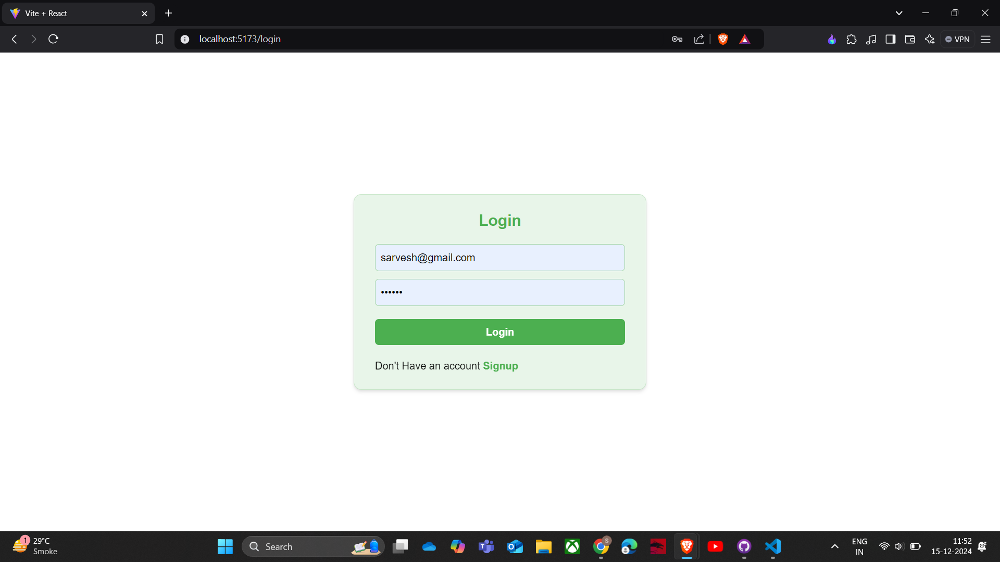
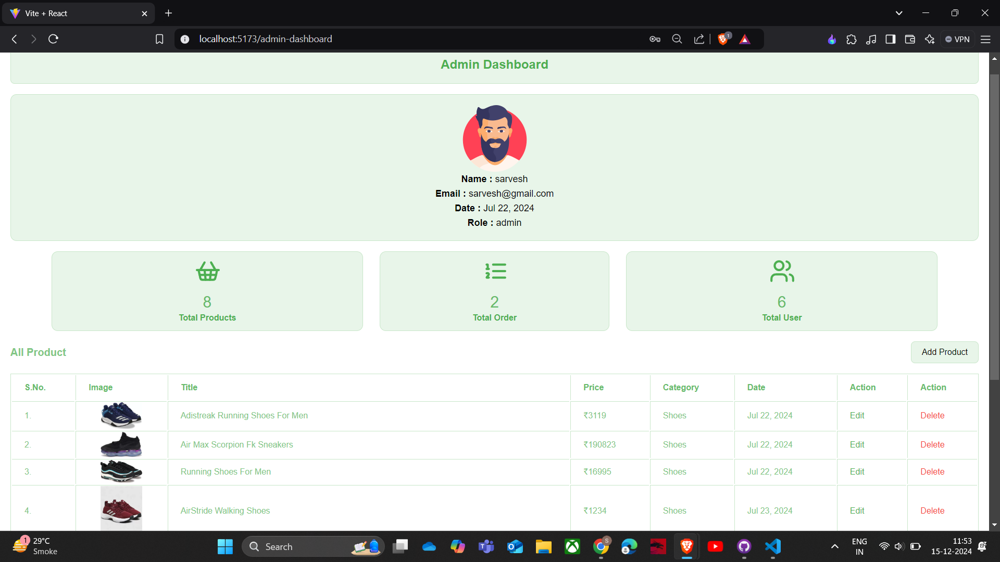
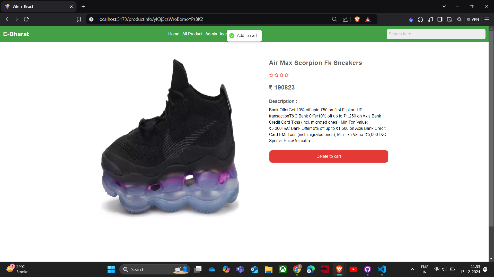
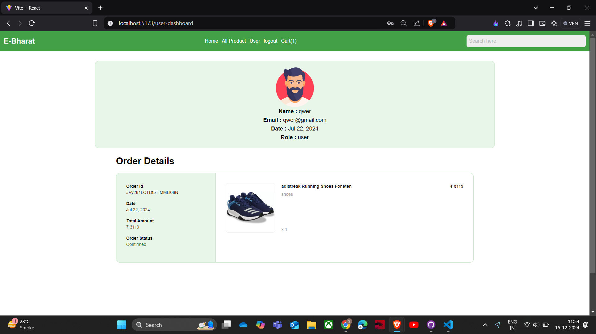

## **Description**

**E-Bharat** is a React-based e-commerce platform designed to provide a seamless and user-friendly shopping experience. Built with modern web technologies like React.js, Tailwind CSS, Firebase, and Redux, it features efficient state management, responsive design, and robust backend integration.

---

## **Demo**

- **Live Demo**: [Project Link](https://ecom-orpin-iota.vercel.app/)

---

## **Features**

- Browse and search for products with an intuitive UI.
- Add items to the cart and manage orders efficiently.
- User authentication powered by Firebase.
- Responsive design for an optimal experience on all devices.
- Efficient state management using Redux for smooth functionality.

---

## **Installation and Usage**

### **Prerequisites**

- Node.js and npm installed on your system.

### **Setup Instructions**

1. Clone this repository:

   ```bash
   git clone https://github.com/your-username/ebharat.git
   ```

2. Install dependencies:
   ```bash
   npm install
   ```
3. Start the development server:
   ```bash
   npm start
   ```
4. Open your browser and navigate to `http://localhost:3000`.

---

## **Technologies Used**

- **React.js**: Frontend framework.
- **Tailwind CSS**: For styling and responsive design.
- **Firebase**: Backend for authentication and data storage.
- **Redux**: State management.

---

## **How It Works**

1. Users can browse products and add them to the cart.
2. Firebase handles user authentication for secure access.
3. Redux ensures smooth state management for product listings, cart updates, and more.

---

## **Screenshots**

Example:  





---

## **Contributing**

Contributions are welcome! Please fork this repository and submit a pull request with your changes.

---
